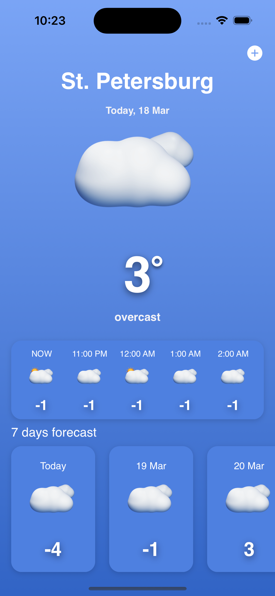
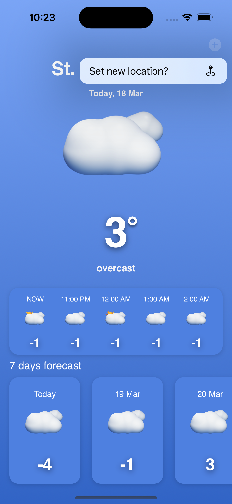
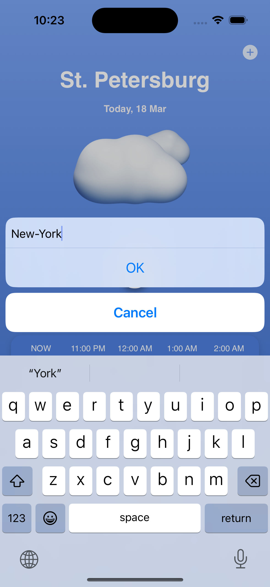
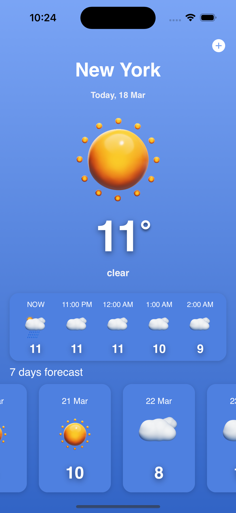

# App "MyWeather" (WeatherApp) for iOS 16.2

## MyWeather - is a mobile application that is designed to display real-time weather.

## Application screenshots

<html>
 <body>
  <p>
    
    
    
    
  </p>
 </body>
</html>

## [Youtube link](https://youtube.com/shorts/Wnj7qYaaBs8)

## Functions

- Show fresh weather when app starts

- Find weather in other cities (worldwide)

- Save the last prompt to display the next time you use it

## Technology stack

- Swift 5.7 - programming language

- MVP - architecture pattern

- UIKit - interface layout framework (UITableView & UICollectionView)

- SnapKit

- Alamofire

- Core Location (CLGeocoder)

- API - Yandex weather

- Unit / UI testing

- GCD

- UserDefaults - storage for the last address

- SOLID

- Dependency Injection

- Delegate pattern

- Factory method pattern

## Unique features

- Animated loading and updating data

- Save the last address

- Cute design

- 3D images of weather conditions

## Test results

Tests cover 91.5 % of the application.

- Unit Tests: all methods of MainPresenter & MainService

- UI Tests: all possible user interactions

## Installation

1. Create a folder

2. In the terminal, pave the path to the folder

3. ``` git init ```

4. ``` git clone https://github.com/0xYanis/WeatherApp```

5. Open in Xcode

6. Connect the iPhone via cable to the PC and select your iPhone from the list of devices in XCode

7. ``` command + r ```

## Working time with the project

Start: 03/14/2023

End: 03/18/2023


Например использовать кеширование или уменьшить количество запросов к серверу.
